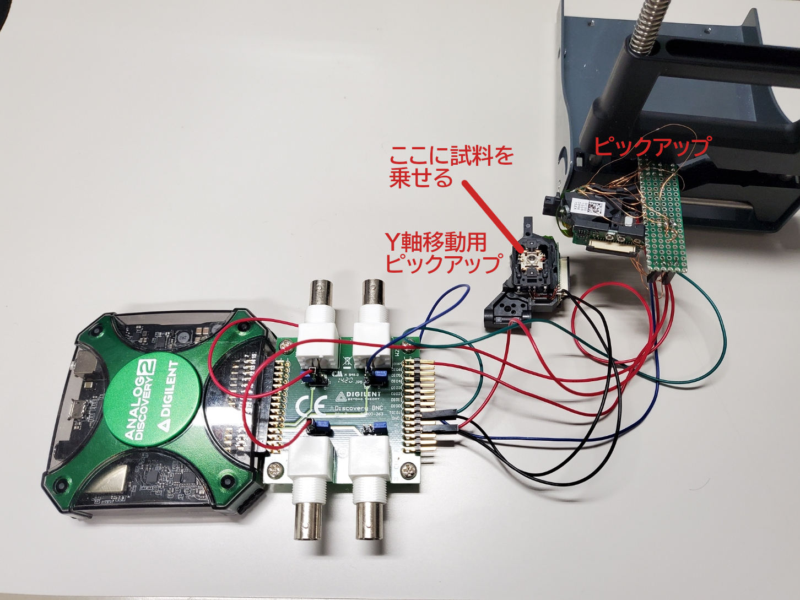
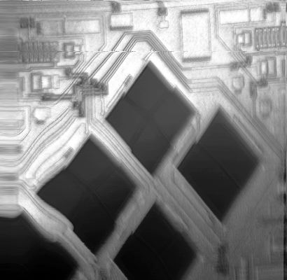
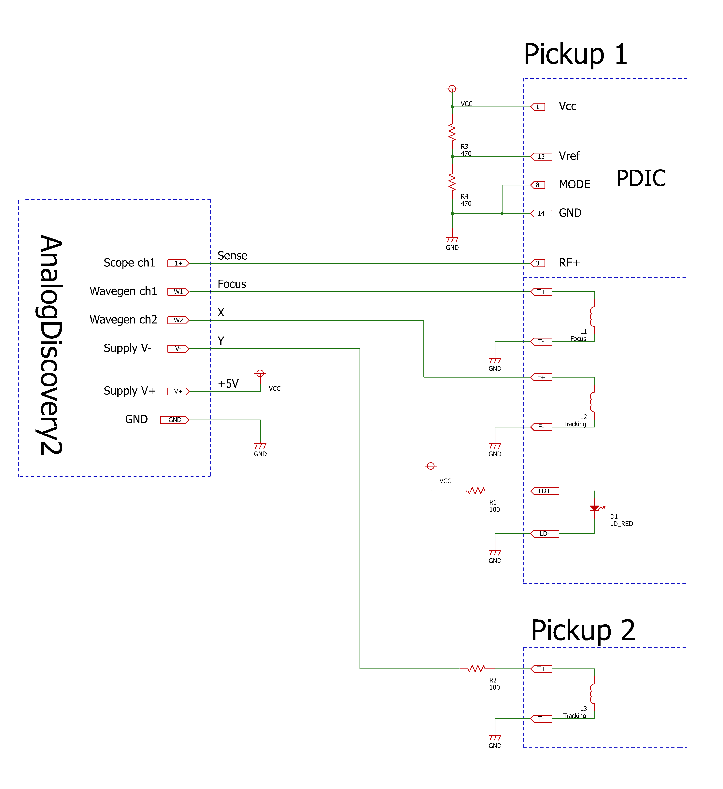
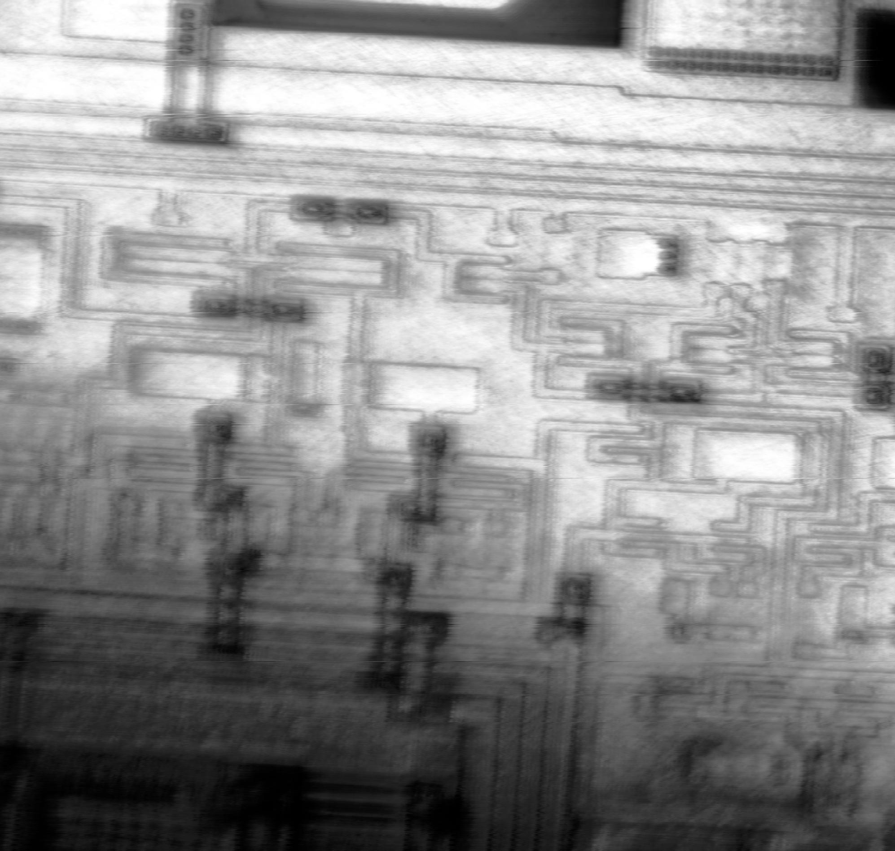
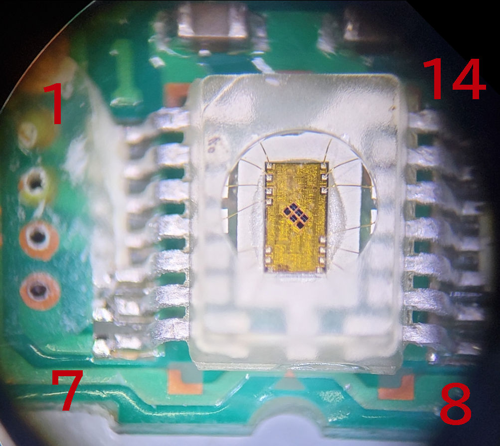
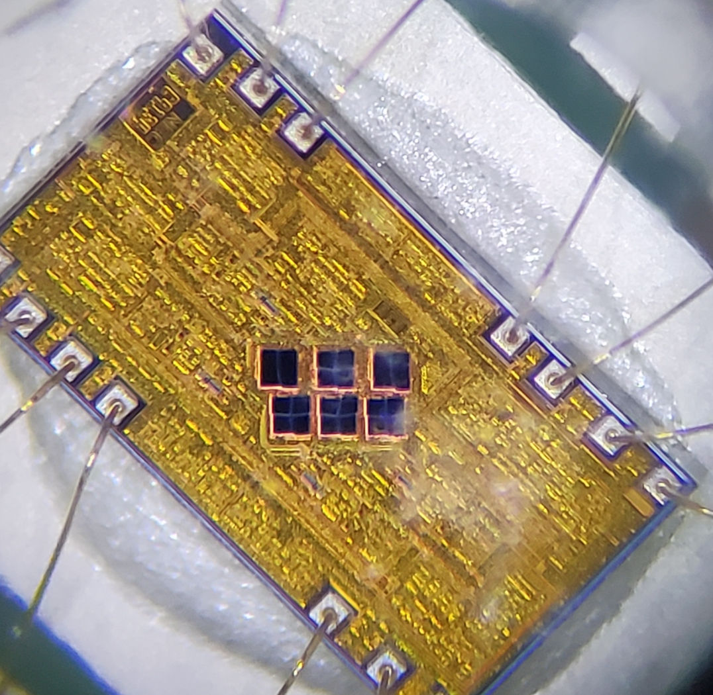
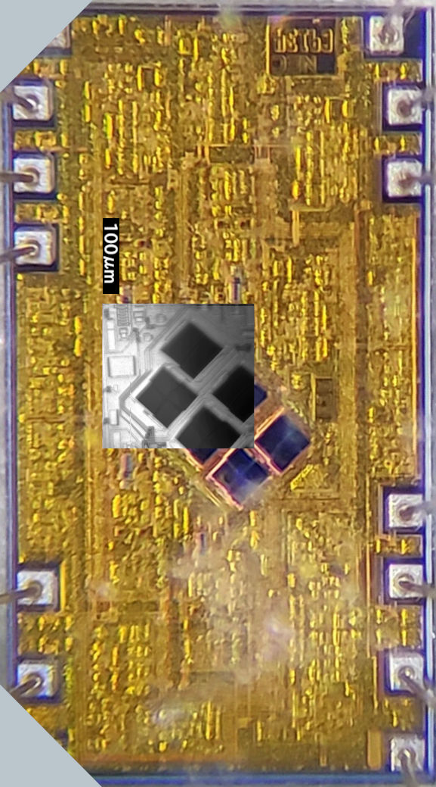
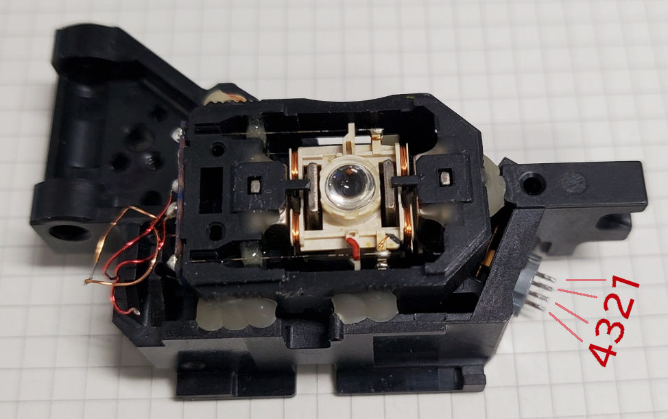

# Super easy way to make a microscope with a DVD pickup
Easily create a laser scanning microscope with 2 DVD pickups and "Analog Discovery".
 
* 日本語版  Original article (Japanese) 
  * [DVDピックアップでレーザー走査型顕微鏡を作る](https://kuriuzublog.wordpress.com/2022/03/22/dvd-pickup-microscope/)

#### Equipment overview

#### Imaging result 

  
Dieshot of Photodetector IC.

## What you need
* DVD pickup x2
  * I used "`HOP-150X`" pickup. You can buy it on AliExpress for 3 USD. 
  * you can use other pickups with known control methods, such as the "`PHR-803T`".
* Analog Discovery 2 x1
  * I think the first AnalogDiscovery could also be used.
* Resistor 100Ω x2
* Resistor 470Ω x2
* some cables
* fixture (like PCB holders)

0.5mm pitch, 26-pin FFC (Flexible Flat Cable) and a conversion adapter make wiring easy.  
I didn't use FFC and pulled the wires out with UEW. Wiring by UEW was painful to work because of the small soldering points.  

## Overview
A microscope can be made by scanning a laser spot horizontally and vertically across a sample, measuring the intensity of the reflected light, and making an image.

The objective lens of the pickup has two voice coil motors for focusing and tracking, and can be moved in two axes.  
To make a microscope, each of the X and Y axes must be driven and scanned in addition to the Z axis of focus. The two axes of the objective lens are not enough for one axis, so a mechanism to drive the other axis must be created.  
Various methods have been proposed to compensate for the missing one axis.  

In this case, we will adopt the simplest method of using a pickup for sample movement.    
Fix the sample to the objective lens of the pickup for sample transfer using double-sided tape.

### Dedicated pickup for sample movement
Add a pickup dedicated to sample movement. Fix the sample on the objective lens and move it with a voice coil motor.  
* [GaudiLabs](https://www.gaudi.ch/GaudiLabs/?page_id=652)
* Pros
  * Easy to make.
  * Good characteristics.
* Cons
  * The size of the sample is limited (weight would be limited to about 1 g).
  * The range of motion is narrow.

### Linear stage
Use a linear stage driven by a stepping motor.
* [loetlabor-jena](https://loetlabor-jena.de/doku.php?id=projekte:dvdlsm:start)
  * Pros
    * Can handle large sample.
    * Large range of motion.
  * Cons
    * Difficult to make.
    * Poor characteristics (backlash, vibration, etc.)

### Speaker as linear actuator
Use speaker as linear actuator.
* [stoppi-homemade-physics](https://stoppi-homemade-physics.de/lasermikroskop/)

## Wire Connection
If you make this seriously, it is quite troublesome to build a voice coil drive circuit with a power op-amp whose output current is about 100mA, make a circuit to read the PDIC output signal with an ADC, write microcontroller software, and so on.  
Therefore, I designed it with the theme of "Let's push all the troublesome things to Analog Discovery 2.  

The +5V power supply is taken from V+ of Supply in AD2.  

The signal outputs ch1 and ch2 are connected to the voice coil to move the objective lens in the focus and X-axis directions.  
V- of Supply is used to drive the voice coil motor of the second pickup, which is in charge of the Y-axis. This only uses half of the range of motion, but it is unavoidable.  

## Program

This is a project file that can be used with Waveforms, the software that comes with AnalogDiscovery.  
[dvd_pickup_laser_microscope.dwf3script](https://github.com/kototoibashi/dvd-pickup-microscope-poc/raw/master/analogdiscovery/dvd_pickup_laser_microscope.dwf3script)

### Focusing

[focus.js](https://github.com/kototoibashi/dvd-pickup-microscope-poc/blob/master/analogdiscovery/focus.js)

Before taking an image, please run this to adjust the focus.   
If the value is outside the ±200 range, the focus is not correct, so adjust the distance between the objective lens and the object.   

Originally, it would be correct to use the astigmatism method for focusing, but I had to create an analog circuit for this purpose, so I decided not to do so.  
The operation is to move the position of the objective lens to find the position where the reflected light is maximized.

### Image Acquisition
[acquision.js](https://github.com/kototoibashi/dvd-pickup-microscope-poc/blob/master/analogdiscovery/acquision.js)

Change `FILENAME` and `SCAN_LINES` before executing.

The `SCAN_LINES` is the number of pixels in the vertical direction. The larger it is, the more detailed the image will be, but the longer it will take to complete the measurement.  
It is recommended to first get a rough image around 50 - 200, and if it looks good, take a real image around 400 - 4000.

Convert the output CSV file to an image and you will get the results of the imaging.  
Normalize to the range of 0-255 and perform gamma correction or histogram equalization to get a nice image.  

## Imaging result

### DVD pickup PDIC
#### Laser scanning microscope
  

#### Typical microscope
  
  
  

##  Reverse engineering "`HOP-150X`" pickup
see also: [DVDピックアップの解析](https://kuriuzublog.wordpress.com/2022/03/15/hop150x-dvd-pickup-reverse-engineering/)

### Laser Diode

|  Pin No.  |  Name  |
| ---- | ---- |
|  1  |  RED LD +  |
|  2  |  GND  |
|  3  |  ?  |
|  2  |  Infrared LD +  |

### Photodetector IC
  

| Pin No. | Name | Type | Note |
| -- | -- | -- | -- |
|1|Vcc|POWER|+5V|
|2|RF-|Diff OUT||
|3|RF+|Diff OUT||
|4|OUT1|Analog OUT|20mVp-p|
|5|OUT2|Analog OUT|20mVp-p|
|6|OUT3|Analog OUT|120mVp-p|
|7|OUT4|Analog OUT|120mVp-p|
|8|MODE_SELECT|Digital IN|L: DVD / H: CD ?|
|9|OUT5|Analog OUT|120mVp-p|
|10|OUT6|Analog OUT|120mVp-p|
|11|OUT7|Analog OUT|20mVp-p|
|12|OUT8|Analog OUT|20mVp-p|
|13|Vref|POWER|2.0 - 2.5V ?|
|14|GND|POWER||